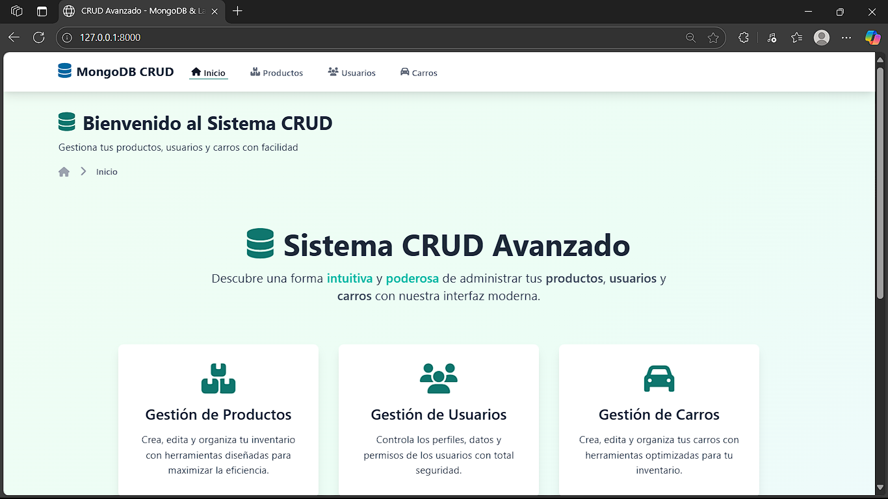
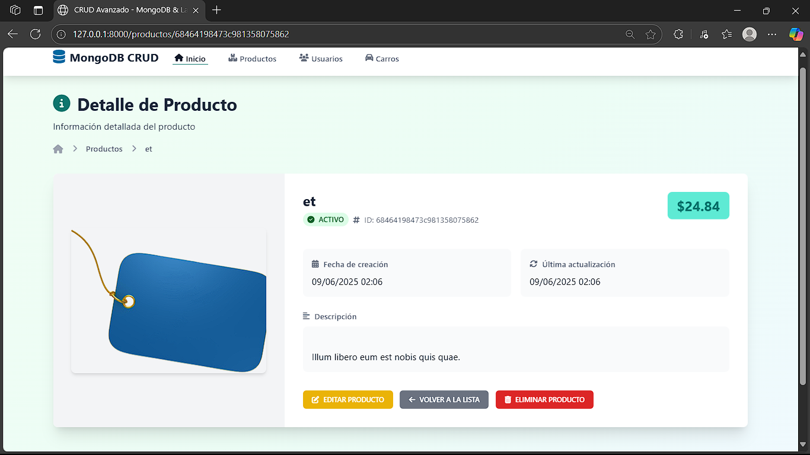

# Proyecto Laravel con MongoDB

Este proyecto implementa un sistema CRUD (Crear, Leer, Actualizar, Eliminar) completo para **Productos**, **Usuarios** y **Carros**, utilizando Laravel y MongoDB como base de datos.

## 📌 Requisitos

- PHP 8.x
- Composer
- Laravel 10.x
- MongoDB
- Extensión MongoDB para PHP:
    - Esta extensión es necesaria para que PHP pueda comunicarse con la base de datos MongoDB.
    - Puedes instalarla usando PECL:
      ```sh
      pecl install mongodb
      ```
    - Luego, agrega la siguiente línea a tu archivo `php.ini`:
      ```ini
      extension=mongodb.so
      ```
    - **Nota:** Dependiendo de tu configuración (Apache, Nginx, etc.), podrías necesitar reiniciar el servidor web para que los cambios surtan efecto. Consulta la documentación específica de tu servidor web si es necesario.

## 🚀 Instalación

1. Clona el repositorio:
   ```sh
   git clone https://github.com/usuario/proyecto-laravel-mongodb.git
   cd proyecto-laravel-mongodb
   ```

2. Instala las dependencias:
   ```sh
   composer install
   ```

3. Configura el archivo `.env` con las credenciales de MongoDB. Este archivo contiene la configuración específica de tu entorno y **no debe ser incluido en el control de versiones (por ejemplo, en Git) si contiene información sensible.**
   ```env
   DB_CONNECTION=mongodb # Especifica que la conexión de base de datos a usar es MongoDB.
   DB_HOST=127.0.0.1    # La dirección del servidor de tu base de datos MongoDB (usualmente localhost).
   DB_PORT=27017        # El puerto en el que MongoDB está escuchando.
   DB_DATABASE=nombre_basedatos # El nombre de la base de datos a utilizar. Laravel la creará si no existe.
   DB_USERNAME=usuario    # El nombre de usuario para acceder a la base de datos (si es necesario).
   DB_PASSWORD=contraseña # La contraseña para el usuario de la base de datos (si es necesaria).
   ```

4. Ejecuta las migraciones y los seeders para poblar la base de datos con datos de ejemplo:
   ```sh
   php artisan migrate:fresh --seed
   ```

## 📂 Estructura del Proyecto

```
├── app/
│   ├── Models/
│   │   ├── Producto.php
│   │   ├── Usuario.php
│   │   ├── Carro.php
│   ├── Controllers/
│   │   ├── ProductoController.php
│   │   ├── UsuarioController.php
│   │   ├── CarroController.php
│   ├── Providers/
│   ├── ...
├── routes/
│   ├── web.php
│   ├── api.php
├── database/
│   ├── seeders/
│   │   ├── ProductoSeeder.php
│   │   ├── UsuarioSeeder.php
│   │   ├── CarroSeeder.php
├── public/
│   ├── imagen3.png
│   ├── imagen2.png
└── ...
```

## 🔥 Ejemplos de Endpoints CRUD

A continuación, se muestran ejemplos de cómo interactuar con los endpoints principales usando `curl`.

### Productos

- **Listar todos los productos (API):**
  ```sh
  curl -X GET http://localhost:8000/api/productos
  ```
  *Nota: La interfaz web para listar productos (accesible normalmente vía `/productos` en el navegador) ahora incluye una barra de búsqueda para filtrar por nombre o descripción.*

- **Obtener un producto específico (reemplaza `{id}` con el ID del producto):**
  ```sh
  curl -X GET http://localhost:8000/api/productos/{id}
  ```

- **Crear un nuevo producto:**
  ```sh
  curl -X POST http://localhost:8000/api/productos \
  -H "Content-Type: application/json" \
  -d '{"nombre": "Laptop Gamer X", "precio": 25999.99, "descripcion": "Laptop de alto rendimiento para juegos."}'
  ```

- **Actualizar un producto existente (reemplaza `{id}` con el ID del producto):**
  ```sh
  curl -X PUT http://localhost:8000/api/productos/{id} \
  -H "Content-Type: application/json" \
  -d '{"nombre": "Laptop Gamer X Plus", "precio": 27999.00, "descripcion": "Versión actualizada de la laptop de alto rendimiento."}'
  ```

- **Eliminar un producto (reemplaza `{id}` con el ID del producto):**
  ```sh
  curl -X DELETE http://localhost:8000/api/productos/{id}
  ```

### Usuarios

- **Listar todos los usuarios:**
  ```sh
  curl -X GET http://localhost:8000/api/usuarios
  ```

- **Crear un nuevo usuario:**
  ```sh
  curl -X POST http://localhost:8000/api/usuarios \
  -H "Content-Type: application/json" \
  -d '{"nombre": "Juan Pérez", "email": "juan.perez@example.com", "password": "passwordseguro"}'
  ```
  *(Otros endpoints de Usuarios como GET por ID, PUT, DELETE siguen un patrón similar al de Productos)*

### Carros

- **Listar todos los carros (o carritos de compra):**
  ```sh
  curl -X GET http://localhost:8000/api/carros
  ```

- **Crear un nuevo carro (asociado a un usuario y con productos):**
  ```sh
  curl -X POST http://localhost:8000/api/carros \
  -H "Content-Type: application/json" \
  -d '{"usuario_id": "ID_DEL_USUARIO", "productos": [{"producto_id": "ID_DEL_PRODUCTO", "cantidad": 2}]}'
  ```
  *(Otros endpoints de Carros como GET por ID, PUT, DELETE siguen un patrón similar al de Productos)*

## 🌟 Ejemplo de Imágenes

Aquí hay ejemplos de imágenes que muestran partes de la aplicación:


*Caption: Interfaz principal de la aplicación.*


*Caption: Formulario de creación de productos.*

*(Aquí se podrían agregar más capturas de pantalla, por ejemplo, una tabla mostrando la lista de productos o la página de perfil de un usuario.)*

## 🛠️ Uso

Para iniciar el servidor:
```sh
php artisan serve
```

## 📌 Contribuir

Si deseas contribuir al proyecto, por favor envía un Pull Request (PR) con tus mejoras o nuevas características. ¡Toda ayuda es bienvenida!

## 📜 Licencia

Este proyecto está bajo la Licencia MIT.

---

¡Esperamos que este `README.md` sea útil para tu proyecto! 🚀 Si necesitas más detalles o tienes alguna sugerencia, no dudes en comunicarte. 😊
